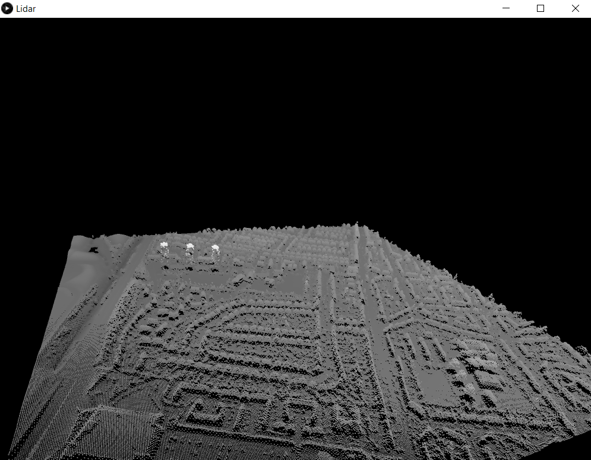

# Lidar Data Reader
[](LICENSE)


#100daysofcode This simple programme written with processing3.
Click <a href="https://processing.org"> here </a> to read more about processing3.<br><br>

LiDAR is an active remote sensing system which uses pulsed laser beams to accurately map out an environment. The basic mechanism is known as “time of flight” measurement in which a laser beam is emitted towards an object, reflected off of the object and then collected in a sensor located within the LiDAR module. When the beam returns, it carries with it information about the object that it contacted including distance and optical characteristics like reflectivity.

## #100daysofcode
Almost a hundred days ago from now (01/10/2020), I decided to do the #100daysofcode challenge. This challenge is simply for someone to code every day and post on social media a picture shows that he wrote a code (every day). And than they share with us the final project.<br>
But me..! I did it differently, every day I built an app, a game, a web page or a desktop app. Every day something new and I shared all my apps simulation on my Instagram account (you can see my highlight stories), click <a href='https://instagram.com/medyanis_hiou'>here</a> if you wanna see it. And than I'll mix all my small apps in one big project. So I decided to share all projects with you.<br>

## Features :dart:
* [x] Free & Open Source
* [x] Very Easy to use
* [x] No Internet connection required

## Options
* [x] 3D view
* [x] Zoom In & Out
* [x] Ability to rotate and move it
* [x] Press the key **"l"** to load another file

## Thank _You_!
Please :star: this repo to help us improve the quality.

## Screenshots
Data Reading
:---------------------:


## Requirements
* processing3

## How To Use It
1. Download Processing3 from this link: https://processing.org/download/
2. Install this repository, click <a href="https://github.com/mohamedyanis/random-colors/archive/master.zip"> here </a> to install it.
3. Extract the folder.
4. Open the ```Lidar.pde``` file.
5. Run it :)

## Contributing 💡
If you want to contribute to this project and make it better with new ideas, your pull request is very welcomed.<br>
If you find any issue just put it in the repository issue section, thank!<br><br>
.سبحَانَكَ اللَّهُمَّ وَبِحَمْدِكَ، أَشْهَدُ أَنْ لا إِلهَ إِلأَ انْتَ أَسْتَغْفِرُكَ وَأَتْوبُ إِلَيْ

